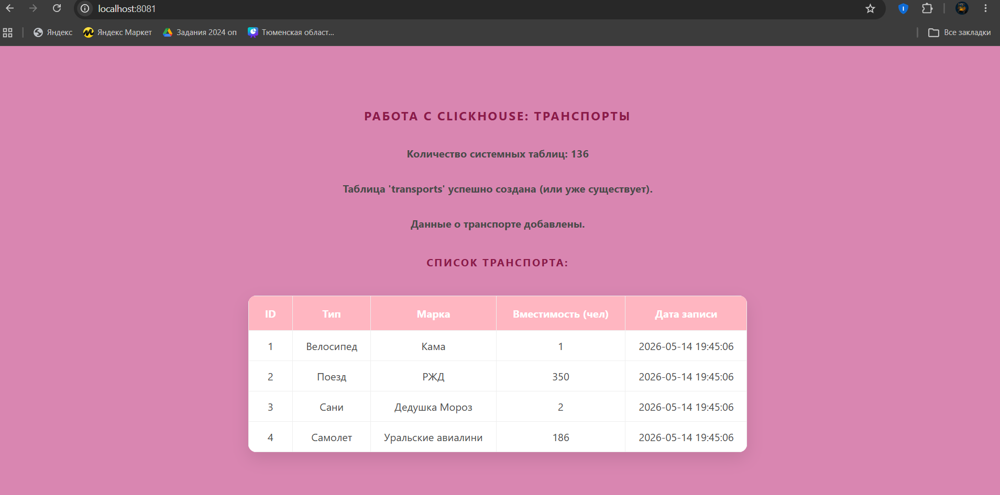

# Лабораторная работа №6: Redis, Elasticsearch, ClickHouse
 Изучение нереляционных баз данных (Redis, Elasticsearch, ClickHouse) и взаимодействие с ними через API с помощью GuzzleClient

## 💃 Автор
Меркулова Елизавета, ПМ-2

## 🌼 Вариант
10 - Трнаспорты на ClickHouse

## 🍽️ Содержимое проекта

```www/ClickhouseExample.php``` — пример работы с Clickhouse

```www/RedisExample.php``` — пример работы с RedisExample

```www/ElasticExample.php``` — пример работы с ElasticExample

```www/index.php``` — основная страница

```docker-compose.yml``` — описание Nginx

```nginx.conf``` — настройка Nginx

```screenshots/``` — скриншоты

## 📸 Скриншоты


## 🎉 Result
Super Puper PHP page with cookies, API and user info! caching has been implemented.
